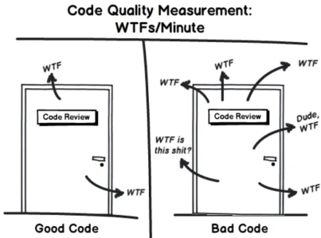
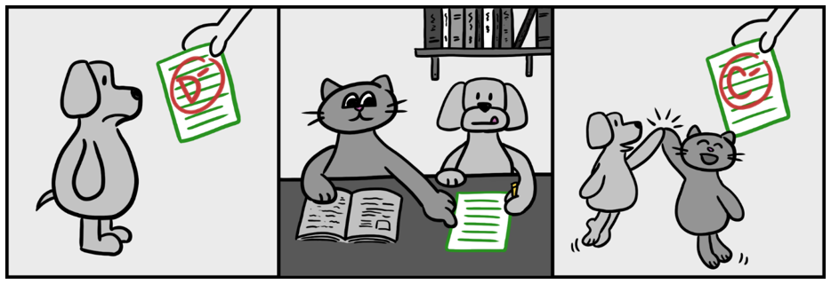
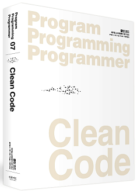
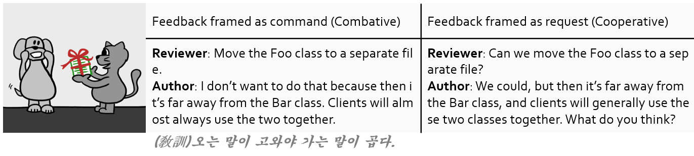
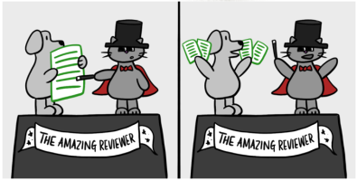

# 프롤로그 (feat. 구글의 코드 리뷰)
여러분들의 코드 리뷰`Code Review` 문화는 안녕하십니까? 코드 리뷰가 문화라는 것을 이미 알고 계신 개발자들은 살포시 뒤로가기를 누르셔도 됩니다. 하지만 코드 리뷰에 대한 교육을 못받았거나, 진지하게 생각해본 적이 없는 개발자들은 가볍게 읽어보시기를 추천드립니다. 

이글은 코드 리뷰 에이전트 양성과정을 통해서 배운 지식을 공유하고, 코드 리뷰 문화를 전파하려는 S/W 개발자의 바람이 담겨있습니다.

깨진 유리창의 법칙

깨진 유리창 하나를 방치해 두면 그 지점을 중심으로 범죄가 확산되기 시작한다는 이론으로, 사소한 무질서를 방치했다간 나중엔 지역 전체로 확산될 가능성이 높다는 의미를 담고있습니다.

소프트웨어 업계에서도 깨진 유리창의 법칙을 자주 인용하고 있습니다. 관리되지 않은 방치된 코드는 `Go to the hell~~`로 가기 쉽다고 말입니다.

<blockquote>

[Broken Window Theory ☞](https://namu.wiki/w/%EA%B9%A8%EC%A7%84%20%EC%9C%A0%EB%A6%AC%EC%B0%BD%20%EC%9D%B4%EB%A1%A0)

"만일 한 건물의 유리창이 깨어진 채로 방치되어있다면 다른 유리창들도 곧 깨어질 것이라는 데 대해 사회심리학자들과 경찰관들은 동의하곤 한다. 이런 경향은 잘사는 동네에서건 못사는 동네에서건 마찬가지이다. (중략) 한 장의 방치된 깨진 유리창은 아무도 신경쓰지 않는다는 신호이며, 따라서 유리창을 더 깨는 것에 대해 아무런 부담이 없다." 

</blockquote>

WTFs per minute

클린 코드 책의 삽화를 공유합니다. 가독성 떨어지는 소스 코드를 읽다보면 WTF(What The F*ck)가 자연스럽게 나오겠죠?

 

# 구글 엔지니어의 코드 리뷰 그라운드 룰
많은 소프트웨어 회사들이 코드 리뷰 시스템을 도입하고 문화를 만들기 위해 노력을 하고 있습니다. 지금부터 구글의 사례를 간략하게 공유드리겠습니다. 코드 리뷰를 진행하기 위해서는 작성자(author)와 검토자(reviewer)가 필요합니다. 각자의 역할이 충실히 수행되어야 코드 리뷰는 유의미한 효과가 있고 다음과 같이 요약할 수 있습니다.

|Reviewer|Author|
|:---|:---|
|코드 리뷰의 표준 원칙|좋은 CL(Change List) 설명을 작성하는 방법|
|코드 리뷰에서 봐야하는 것|변경 사항을 작게 나누기|
|리뷰 중인 코드 변경사항 탐색|리뷰어의 의견을 다루는 방법|
|코드 리뷰의 속도||
|코드 리뷰에 의견을 작성하는 방법||
|코드 리뷰에서 반대 의견을 다루는 방법||

 

# Reviewer guide (1/6) : 코드 리뷰의 표준 원칙
코드 리뷰어는 코드 변경점(Change List)이 완벽하지 않더라도 코드 품질이 확실히 개선되는 상태가 되었다면, 리뷰어는 해당 변경점을 승인하는 방향으로 고려해야합니다.

여기서의 핵심은 `“완벽한” 코드는 없으며 더 나은 코드만 있다`는 것입니다. 따라서 완벽하지 않더라도 코드 변경사항이 유지보수, 가독성을 개선시킨다면 며칠 또는 몇 주 동안 코드 리뷰가 지연되어서는 안됩니다. 

당신의 의견이 순전히 교육적이라면, 반드시 ＂Nit:＂과 같은 접두어를 붙여 코드 작성자에게 참고하라는 의미를 전달하도록 가이드 하고 있습니다. Nit은 Nitpick의 약자로 우리말로 번역하면 “트집 잡다”라는 의미입니다.

소프트웨어 설계에 관해서는 절대 스타일이나 개인적인 선호를 따라서는 안됩니다.

아래 그림에서 표현하듯이 D 수준의 변경점을 승인하기 위해서 A 수준이 될 때까지 지연시키지 말고, C 수준만되어도 승인을 해주라는 의미입니다.

# Reviewer guide (2/6) : 코드 리뷰에서 봐야하는 것
코드 리뷰를 수행할 때 아래 사항을 확인해야 합니다.
> 설계(Design), 기능(Functionality), 복잡도(Complexity), 테스트(Test), 작명(Naming), 주석(Comments), 스타일(Style), 문서화(Documentation), 문맥(Context), 좋은 점(Good Things)

코드가 잘 설계되어 있는지, 기능이 정상 동작하는지 확인해야합니다.

“너무 복잡하다”는 말은 보통 코드를 빠르게 이해할 수 없다는 의미이므로, 버그 발생 가능성이 높다는 의미입니다. 

단위 테스트가 반드시 포함되었는지 확인하고, 명확한 작명을 했는지 확인해야합니다.

의미 없는 주석은 제거하고 유용한 주석만 남기도록 리뷰해야합니다.

요즘은 동작하는 소프트웨어가 최고의 문서라고 합니다.
표준 스타일 가이드를 잘 지켰는지 확인해야합니다.

리뷰어는 요청 받은 모든 코드 라인을 리뷰하고, 문맥을 살피고, 코드 품질을 개선하고 있는지, 코드 작성자가 잘한 점에 대해서 칭찬하면서 리뷰를 해줘야 합니다.

FYI. 추천 책

 

# Reviewer guide (3/6) : 리뷰 중인 코드 변경사항 탐색

* 1단계: 변화를 광범위하게 리뷰하고,
* 2단계: 코드 변경사항의 주요 부분 검토하고,
* 3단계: 나머지 변경사항을 적절한 순서대로 확인해야합니다.

아는 만큼 보인다는 격언처럼 소프트웨어의 `기술적 탁월함`을 갖춰야 리뷰도 잘할 수 있습니다.

# Reviewer guide (4/6) : 리뷰의 속도
### 왜 코드 리뷰를 빠르게 해야할까요?
구글에서는 개인이 코드를 작성할 수 있는 속도를 최적화기보다 팀이 제품을 함께 생산할 수 있는 속도를 최적화해야 한다고 말하고 있습니다.

### 그럼 얼마나 빨라야 할까요?
코드 리뷰 요청을 받자마자 진행하길 지향합니다.
업무일 기준으로 하루를 넘기는 것은 지양합니다. 즉, 다음날 아침의 첫 번째 업무가 코드 리뷰가 되도록 우선순위를 높여야 합니다.

### 속도 vs. 방해
만약 당신이 코드 작성과 같이 집중된 작업을 하고 있다면, 코드 리뷰를 위해 일을 멈추지는 말라고 얘기하고 있습니다.

### 리뷰 속도가 느리다면?
당연히 리뷰속도가 느리면 팀전체의 속도가 느려집니다.
개발자들이 코드 리뷰 프로세스에 대해 불만이 쌓이기 시작합니다. 굳이 필요한 개발 절차인지 의심을 한다는 의미입니다.

# Reviewer guide (5/6) : 코드 리뷰에 의견을 작성하는 방법
1. 정중하게 논증해야 합니다.  자신의 추론을 입증하고  의견이 있는 건설적인 LGTM(Looks Good To Me)을 주도록 노력해야 합니다.
2. 명확한 가이드를 주는 방법1과 문제점만 제시하고 코드 작성자가 결정하는 방법2을 균형 있게 해야합니다.  
방법2는 개발자의 학습에 도움이 되며, 작성자가 리뷰어 보다 코드를 더 잘 알기 때문에 더 좋은 방법을 얻을 수 있습니다.  일반적으로 코드 변경사항을 수정할 책임은 리뷰어가 아닌 코드 작성자에게 있습니다.
3. 코드 작성자에게 복잡한 부분에 대한 설명을 요청하는 대신에 코드를 단순화하거나 의미 있는 주석을 추가하도록 권장하는 방법도 좋습니다.

# Reviewer guide (6/6) : 코드 리뷰에서 반대 의견을 다루는 방법

### Dead Lock

코드 리뷰에서 최악의 결과는 `교착 상태`입니다. 여기서 교착 상태는 작성자는 리뷰어의 의견을 반영하기를 거부하고, 리뷰어는 의견이 반영되지 않았으니 승인하지 않는 상황을 말합니다.

교착 상태가 발생하면 우선 만나서 이야기를 하는 게 좋습니다. 텍스트에 기반한 커뮤니케이션은 서로가 인간이라는 것을 잊게 만들고 오해로 인해 잘못된 커뮤니케이션을 만들 가능성이 높습니다.

교착 상태가 길어지면 리뷰어와 작성자의 사이가 점점 나빠지게 되는데, 수준 낮은 코드를 승인함으로 발생하는 품질 손해보다 동료와 다퉈서 발생하는 품질 손해가 더 크다고 합니다. 가능하다면 어느 한 사람이 인정해 교착을 해결하고 그럴 수 없다면 리더에게 문제를 전달해 다른 리뷰어가 리뷰를 진행할 수 있게끔 만들어야 합니다.

교착이 발생한 경우엔 매니저, 또는 리더와 상의하고 휴식을 가지는 것이 좋다고 합니다. 특히 교착을 만들어낸 두 사람이 관계가 회복될 때까지는 서로 코드 리뷰를 요청하지 않도록 해야 한다고 합니다.

위의 모든 내용을 다 지켰음에도 리뷰어와 개발자 사이의 갈등이 있다면, 다시 한번 코드 리뷰의 표준 원칙을 참고하시기 바랍니다.
> `“완벽한” 코드는 없으며 더 나은 코드만 있다`

### 나중에 정리 할게요.
> `르블랑의 법칙`  
> 즉 나중은 결코오지 않습니다. 오늘 할 일을 내일로 미루지 않도록 확인해야 합니다.

개발자들은 일반적으로 일을 빨리 끝내고 싶어합니다. 따라서 코드 변경사항을 반영할 때 사소한 내용에 대한 리뷰를 하고 싶어하지 않습니다. 그래서 나중에 정리한다고 하는데, 당신은 지금 수정되도록 해야 합니다. 몇몇 개발자들은 후속 커밋(변경사항)을 반영하여 이런 문제들을 해결하기도 하지만 경험에 따르면 개발자가 기존 변경사항을 작성한 후 시간이 지날수록 이러한 정리 작업은 덜 일어납니다. 사실, 개발자가 현재의 코드 변경사항을 처리한 후 정리를 하지 않는 한, 정리 작업은 절대 일어나지 않습니다. 개발자가 무책임한 것이 아니라 해야할 일이 많고 다른 작업으로 인해 잊혀지기 때문입니다. 

따라서 코드 리뷰가 완료되기 전에 지금 코드 정리를 해야 한다고 주장하는 것이 가장 좋습니다. “나중에 정리하도록” 하는 것은 코드의 품질을 떨어뜨리는 일반적인 원인이 됩니다.

코드 변경사항에서 새로운 복잡한 로직이 있다면, 긴급상황이 아닌 한 반영 전에 정리해야 합니다. 만약 지금 당장 진행할 수 없다면 이슈를 제기하고, 생성한 후 자신에게 할당해야 합니다. 또한 선택적으로 제기된 이슈를 참조하는 코드에 TODO 코멘트를 작성할 수도 있습니다.

# Author guide (1/3) : 좋은 CL 설명을 작성하는 방법

팀마다 다양한 양식이 있고, 그라운드 룰을 정해서 잘 지키면 됩니다. 

구글에서는 첫 줄에는 수행 중인 작업에 대한 간략한 요약을 기록해야 합니다. 명령문처럼 쓰여진 완전한 문장을 선호하고 바로 뒤에 줄 바꿈을 넣으라고 가이드하고 있습니다.

> As Was : “FizzBuzz RPC 삭제와 새 시스템으로 교체”  
> To Be : “FizzBuzz RPC를 삭제하고 새 시스템으로 교체한다”

이 CL이 기능 변경인지 리팩토링 인지 등 CL이 실제로 무엇을 하는지 설명을 해야합니다. 

# Author guide (2/3) : 변경 사항을 작게 나누기

왜 CL을 작게 해야할까요? 작고 간단한 CL은,

### 리뷰를 빠르게 할 수 있습니다.
하나의 큰 CL을 30분 동안 리뷰하는 것보다 여러 개로 나뉜 CL을 5분씩 여러번 리뷰하는 것이 효과가 더 좋습니다.

### 더 철저하게 리뷰받을 수 있습니다.
리뷰어와 코드 작성자는 큰 규모의 변경사항으로 인해 생기는 수많은 의견들로 인해 리뷰의 어려움을 느낄 수 있습니다. 때로는 중요한 요점을 놓칠 수도 있습니다.

### 버그가 발생할 가능성이 적습니다.
적은 변경사항은 CL이 적용될 때의 영향을 효과적으로 파악할 수 있기 때문에 버그가 생길 요소에 대한 판단을 쉽게 할 수 있습니다.

### 리뷰가 반려되었을 때의 낭비되는 시간이 적습니다.
만일 당신이 거대한 CL을 작성했는데, 리뷰어가 전반적인 진행 방향이 틀렸다고 리뷰를 반려한다면 당신은 많은 작업을 낭비하게 될 것입니다.

### 코드를 합치기(merge) 쉽습니다.
대규모의 CL은 시간이 오래 걸리기 때문에 코드를 머지할 때 많은 충돌이 발생하며, 자주 머지를 진행해야 합니다.

### 더 잘 설계할 수 있습니다.
큰 변경사항의 모든 세부적인 부분을 수정하는 것보다 작은 변경사항의 설계와 코드 품질을 다루는 것이 훨씬 쉽습니다.

### 리뷰로 인한 업무 진행 차단이 적습니다. 
현재 CL을 기다리는 동안 계속 개발할 수 있습니다.

### 더 간단하게 롤백할 수 있습니다. 
거대한 CL은 초기의 CL과 롤백 CL 사이에서 업데이트 되는 파일을 수정할 가능성이 높기때문에 롤백을 복잡하게 만듭니다. (conflict 발생으로 중간에 있는 CL들도 롤백을 해야할 경우도 있습니다.)

리뷰어는 `CL이 너무 크다는 이유` 하나만으로도 당신의 리뷰를 완전히 `거절`할 수 있다는 점을 주의해야 합니다. 
대부분 당신의 개발 기여에 고마워하지만 어떻게든 작은 CL로 만들어줄 것을 요청합니다. 
이미 거대해진 CL을 분할하는 것은 더 어려울 수 있기때문에 처음부터 CL을 작게 작성하는 것이 더 좋습니다.

### 작은 CL은 무엇일까요?
일반적인 CL의 적절한 크기로는 하나의 독립된 변경사항만 있어야 합니다. CL은 단지 하나의 변경만 다루는 최소한의 변경사항입니다. 리뷰어가 CL에 대해서 알아야하는 모든 내용은 CL과 CL 설명문 그리고 코드 베이스 또는 이미 검토한 CL에 있어야 합니다. 
CL을 반영한 후에도 시스템이 잘 작동해야 합니다. 새로운 API를 추가할 때에는, 그 API를 사용하는 곳도 동일한 CL에 포함하여 리뷰어가 API 사용법을 더 잘 이해하도록 해야합니다. 또한 사용하지 않는 API는 포함하면 안됩니다.

“너무 크다” 라는 것에 대한 규칙은 없습니다. 일반적으로 100줄 정도가 적합하지만 1000줄은 너무 큽니다. 하지만 이것은 리뷰어의 판단에 달려있습니다. 한 파일에 200줄의 변경은 괜찮지만, 보통 50개의 파일에 분산되어 있는 경우는 좋지 않습니다.

코드를 작성한 당신은 코드에 대해서 잘 알지만, 리뷰어는 전후 관계의 맥락을 모르는 것을 명심해야 합니다. 당신은 적절한 크기의 CL로 생각하지만, 리뷰어에게는 부담이 될 수 있습니다. 확실하지 않다면, 자신이 생각하는 것보다 더 작게 작성하면 됩니다. 리뷰어는 너무 작은 CL에 대해서 거의 불평이 없습니다.

### 언제 큰 CL이 허용되는가?
거대한 변경사항이 나쁘지 않은 몇 가지 상황이 있습니다.
전체 파일을 삭제하는 것은 한 줄의 변경으로 간주할 수 있습니다. 리뷰어가 검토하는데 오래 걸리지 않기 때문입니다.
완전히 신뢰할 수 있는 자동 리팩토링 도구에 의해 생성된 코드도 포함됩니다만 머지 또는 테스트에는 위의 일부 지침이 적용됩니다.

### 리팩토링 분리하기
일반적으로 리팩토링은 기능 변경이나 버그 수정과 `별도`의 CL에서 진행하는 것이 가장 좋습니다. 
예를 들어, 클래스를 옮기고 이름을 변경하는 것은 해당 클래스에서 버그를 수정하는 것과 다른 CL에 있어야 합니다. 리뷰어의 입장에서 변경사항을 이해하기 더 쉽습니다.
하지만 지역 변수의 이름 수정과 같은 작업은 기능 변경 또는 버그 수정 CL에 포함될 수 있습니다. 리팩토링이 너무 커서 현재 CL 리뷰가 너무 어려워진다면 리뷰어와 코드 작성자가 판단하면 됩니다.

### 관련된 테스트 코드는 동일한 CL에 포함한다.
테스트 코드를 별도의 CL로 분리하지 않습니다. 코드 수정을 검증하는 테스트는 코드의 라인 수가 증가하더라도 동일한 CL에 포함되어야 합니다. 그러나 독립적인 테스트 수정사항은 위의 리팩토링 가이드와 유사하게 별도의 CL로 작성할 수도 있습니다. 

### 빌드에 영향이 없어야 한다.
서로 의존하는 여러 개의 CL이 있는 경우, 각각 CL이 따로따로 반영된 후에도 전체 시스템이 계속 잘 동작해야 합니다. 그렇지 않으면 CL이 반영된 후에 동료 개발자의 빌드를 멈추게 할 수 있습니다.

# Author guide (3/3) : 리뷰어의 의견을 다루는 방법

1. 개인적인 감정으로 대응하지 않아야 합니다.
리뷰 의견에 절대 분노를 표출하지 마시기 바랍니다.
2. 리뷰 의견을 수용한다면 그에 맞게 코드를 수정하면 됩니다.
3. 리뷰어가 옳은지, 스스로 생각해보고 판단하시면 됩니다.
4. 의견 충돌은 정중한 자세로 해결하고 Reviewer 갈등 해결 항목과 유사합니다. 교착 상태에 빠지면 다시한번 표준 원칙을 상기하면서 검토해보면 됩니다.
즉, `완벽한 코드는 없고, 더 나은 코드`만 있습니다.

# 에필로그
좋은 코드 리뷰 문화를 수용하고 전파하기 위해서는 과연 어떻게 해야할까요? 개발자들에게 소프트웨어 장인정신, 애자일 마인드셋 등을 교육시키면 해결될까요? 분명한 것은 나 자신부터 변하고 모두가 함께 노력해야 코드 리뷰 문화를 만들수 있을 것입니다. 식상하지만 꼭 말하고 싶은 슬로건을 외치며 글을 마무리 하겠습니다.

* `빨리` 가고 싶으면 `혼자` 가고, `멀리` 가고 싶으면 `함께` 가라.
* 지금처럼 살거나 지금부터 살거나

# Reference
* [Google Engineering Practices Documentation](https://google.github.io/eng-practices/)

<!-- * [코드 리뷰에 대한 구글 논문? a](/_posts/2023-03-11-code_reivew_case_study_at_google.md)
* [코드 리뷰에 대한 구글 논문? b](2023-03-11-code_reivew_case_study_at_google.md)
* [코드 리뷰에 대한 구글 논문? c](../_posts/2023-03-11-code_reivew_case_study_at_google.md) -->

<!-- 왜 상대경로는 안되고, URL 형식만 될까? 이유를 못찾아서 pass -->
* [코드 리뷰에 대한 구글 논문?](https://deity719.github.io/TIL/2023-03-11-code_reivew_case_study_at_google/)

[설문결과] 개발자들의 코드 리뷰 애로사항...

<blockquote>

개발자들의 코드 리뷰 애로사항에 대한 설문결과입니다. DS 부문 `코드 리뷰 에이전트 양성과정`의 설문결과에 근거한 자료에서 발췌하였습니다.

</blockquote>

