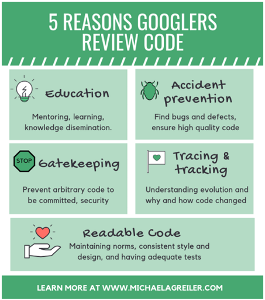

구글에서 [코드 리뷰에 대한 사례 연구](https://sback.it/publications/icse2018seip.pdf)라는 제목으로 논문을 발표한 자료가 있어서 공유합니다.

# Motivations Introduction
구글에 처음 코드 리뷰를 도입한 사람의 인터뷰에 따르면,  
개발자가 `다른 개발자들이 이해할 수 있는 코드`를 작성하도록 하기 위해서 코드 리뷰를 시작했다고 합니다.

# Motivations Current Expectations
구글 개발자들이 코드 리뷰를 통해 기대하는 것은 크게 5가지로 요약됩니다.

<!-- <blockquotes> -->

1. Education  
코드 리뷰를 통해 개발자에게 언어, 프레임워크 또는 일반적인 소프트웨어 설계 원칙에 대해 새로운 것을 가르치는 중요한 기능 을 수행

2. Maintaining norms  
Formatting 이나 API 사용 패턴 등 코딩 스타일 규범 유지

3. Gatekeeping  
소스 코드, 디자인적 선택, 산출물에 대한 경계를 설정하고 유지

4. Accident pervention  
버그, 결함, 코드 품질 저하와 관련된 문제를 사전에 방지

5. Tracing history  
코드 변경점에 대한 이력 관리

<!-- </blockquotes> -->
> **시사점** 
> 코드 리뷰는 문제 해결에 집중하는 것이 아니라, `가독성(Readability)`과 `유지보수성(Maintainability)`을 제일 중요하게 생각합니다.
> 교육, 규범을 유지하는 것 뿐만 아니라, 추적 이력, Gatekeeping 및 사고 방지, 결점 발견은 환영하지만 유일한 관심사는 아닙니다.

 
 

# Knowledge Spreading
코드 리뷰를 통해 지식 전파를 측정하려는 시도를 정량적으로 보여주는 차트 입니다.
시간이 지남에 따라 리뷰 comments 수가 감소한다는 것을 보여주고, 코드 리뷰가 익숙해질수록 더 빨리 LGTM(Looks Good To Me)을 획득하게 됩니다.

# Practices Quantifying The Review Process
### 리뷰 주기 및 속도
80%의 개발자가 주(week)당 `7개의 변경, 10개의 리뷰`를 수행합니다.
코드 리뷰 프로세스는 평균적으로 `4시간 이내`에 완료합니다. (작은 변경은 1시간 이내, 그리고 규모가 큰 변경은 5시간 이내) 빠른 리뷰를 지향하는 구글 엔지니어의 문화를 확인할 수 있습니다.
- AMD, Chrome OS, MS의 경우 14.7~24 시간의 리뷰 주기가 소요된다고 비교하고 있습니다.

### 리뷰 크기
변경의 35%가 하나의 파일, 90%가 10개 파일 미만입니다.
변경된 라인의 평균 LOC는 24입니다.

# Developer's Perceptions Challenges
### Distance
* 지리적 거리 : 리뷰어와 작성자의 물리적 거리
* 구조적 거리 : 다른 팀 혹은 다른 역할 담당
이 거리감이 리뷰 과정의 지연(delay)로 이어지거나 오해를 야기시키기도 합니다.

### Social Interactions
* Tone : 작성자들이 코멘트에 대해 감정적이 될 수 있고, 부정적인 톤으로 코멘트를 하는 경우 악영향을 끼칠 수 있습니다.
* Power : 코드 리뷰를 통해 어떤 사람이 다른 사람의 행동을 바꾸려고 일부러 승인을 미루거나 리뷰를 질질 끄는 행위를 하지 말아야 합니다.
소통 방식의 이슈는 개발자들을 불편하게 하거나 좌절하게 만들고, 코드 리뷰 문화를 오염시킬 수 있습니다.

### Review Subjects
* Design review : 어떤 사람들은 리뷰 이전에 디자인 결정되기를 원하고, 어떤 이들은 리뷰 중에 디자인을 변경하기를 원합니다.
서로 다른 기대감이 있기 때문에 리뷰 과정 중에 마찰이 생길 수 있습니다.

### Context
변경점(Change List)이 프로덕션 상의 급한 fix 인지, 왜 이런 변경을 했는지 모호한 경우, 리뷰가 늦어지게 되거나 좌절감을 불러일으킬 수 있습니다.

# Developer's Perceptions Satisfaction
구글 개발자들이 코드 리뷰를 가치 있고, 효율적인 매우 중요한 프로세스로 생각하고 있습니다. 또한 코드 변경에 대한 피드백의 양이 적절하다고 생각합니다.

# Conclusion
개발자는 코드 리뷰를 통해서 
* 코드베이스에 대해 서로 가르치고,
* 팀 코드베이스의 무결성을 유지하며, 
* 가독성과 일관성을 보장하는 규범을 구축, 확립, 발전시킬 수 있습니다.

### [Google's Engineering Practices Documentation](https://google.github.io/eng-practices/)
* 모든 변경점(Change List or Pull Request)은 소프트웨어의 전반적인 품질을 증가시킵니다.
    * The Code improves the overall health of the system
* 더 개선된 코드를 반영하는 것을 지연시키지 마세요.
    * Quick code reivews, responses and feedback
    * A key point here is that there is no such thing as `perfect code`, there is only `better code`.
* 코드 리뷰하는 동안 지식과 경험을 나눔으로써 멘토십을 제공하도록 노력하세요.
    * Educate and inspire during the code review

# Reference
<!-- 왜 상대경로는 안되고, URL 형식만 될까? 이유를 못찾아서 pass -->
* [구글의 코드 리뷰 문화는?](https://deity719.github.io/2023-03-10-code_review_at_google/)